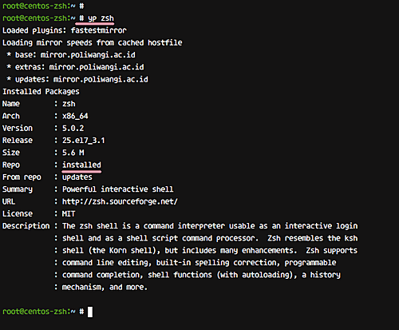

----------------------------------------------------------------------------------------------------------------
     

Como instalar o ZSH e Oh-my-zsh no Linux

----------------------------------------------------------------------------------------------------------------
<a href="#zsh0">1- O que é o ZSH?</a>  
<a href="#zsh1">2- O que é Oh-my-zsh?</a>  
<a href="#zsh2">3- Prerequisitos</a>   
<a href="#zsh3">4- O que faremos</a>  
<a href="#zsh4">5- Passo 1 - Instalar e configurar o ZSH</a>  
<a href="#zsh5">6- Passo 2 - Instalar e configurar o Oh-my-zsh framework</a>  
<a href="#zsh6">7- Passo 3 - Alterar temas padrão</a>  
<a href="#zsh7">8- Passo 4 - Ativar plugins Oh-my-zsh</a>  

----------------------------------------------------------------------------------------------------------------
<h2 id="zsh0">1- O que é o ZSH?</h2>

O Z shell ou zsh é um shell interativo UNIX e um poderoso interpretador de linha de comando para linguagem de 
script, incluindo shell script. 
Zsh foi desenvolvido por 'Paul Fastad' em 1990, e o nome 'zsh' vem do professor de Yale, Zong Shao.

O Z-Shell tornou-se um dos shells mais populares para o sistema operacional Linux. É rico em recursos e fácil de configurar e personalizar.
Abaixo estão algumas funções importantes do zsh:
     
    Comando auto-complete
    Melhor manuseio de variáveis
    Correção ortográfica
    Histórico de comando compartilhado
    TAB para completar
    Fácil configuração de variável de ambiente

----------------------------------------------------------------------------------------------------------------
<h2 id="zsh1">2- O que é Oh-my-zsh?</h2> 

Oh-my-zsh é uma estrutura de código aberto para gerenciar o ZSH. Existem também outros frameworks para o z shell, 
como prezto, Zgen, Antigen, etc. Neste tutorial, usamos 'oh-my-zsh' para nossa configuração zsh.

Oh-my-zsh é uma estrutura baseada na comunidade com muitas funções. Ele vem com um design personalizável e possui 
um extenso catálogo de plugins administradores de sistema e desenvolvedores.

Neste tutorial, mostraremos como instalar o Z-Shell ou o zsh no Ubuntu Linux. Então nós configuramos o framework 
oh-my-zsh para gerenciar zsh. Também mostraremos como alterar o tema zsh e ativar plugins.

----------------------------------------------------------------------------------------------------------------
<h2 id="zsh2">3- Prerequisitos</h2> 
    
    Linux - Ubuntu 16.04 or CentOS 7.6
    Root privileges

----------------------------------------------------------------------------------------------------------------
<h2 id="zsh3">4- O que faremos</h2> 
   
    - Instalar e configurar o ZSH
    - Instalar e configurar o framework Oh-my-zsh
    - Alterar o tema padrão
    - Ativar plugins oh-my-zsh
----------------------------------------------------------------------------------------------------------------
<h2 id="zsh4">5- Passo 1 - Instalar e configurar o ZSH</h2> 

Nesta etapa, instalaremos o repositório do Z shell e em seguida configuraremos um usuário para usar o Z shell 
com o tema padrão. Basicamente, o shell padrão no Ubuntu é o bash, então vamos configurar um usuário root para 
usar zsh como o shell padrão.

Para instalar o zsh a partir do repositório, use os seguintes comandos:
apt instalar zsh

Após a conclusão da instalação, altere o shell padrão do usuário root para zsh com o comando chsh abaixo:
chsh -s /usr/bin/zsh root

Agora faça logout do usuário root, efetue login novamente e você obterá o shell zsh.
Verifique o shell atual usado com o comando abaixo. \
> <b>echo $ SHELL<b/> 
----------------------------------------------------------------------------------------------------------------

----------------------------------------------------------------------------------------------------------------

----------------------------------------------------------------------------------------------------------------
<h2 id="zsh5">6- Passo 2 - Instalar e configurar o Oh-my-zsh framework</h2> 

Agora que o Z shell está instalado, vamos instalar o frameork oh-my-zsh para gerenciar o zsh z shell.

Oh-my-zsh fornece um script de instalação para instalar o framework, e nós precisamos instalar alguns outros \
pacotes requeridos, incluindo o wget para baixar o script do instalador e o Git para fazer o download do shell \
oh-my-zsh do GitHub.

Então o primeiro passo é instalar o wget e o git no sistema. Aqui estão os comandos que você precisa executar:
> <b>apt install wget git<b/> 

Agora vamos fazer o download e executar o script de instalação:
> <b>wget https://github.com/robbyrussell/oh-my-zsh/raw/master/tools/install.sh -O - | zsh<b/> 

O resultado deverá ser similar a imagem abaixo:

----------------------------------------------------------------------------------------------------------------

----------------------------------------------------------------------------------------------------------------

Ok, oh-my-zsh está instalado e seu diretório inicial é ~/.oh-my-zsh. \
Agora devemos criar uma nova configuração para o zsh, assim como no shell Bash que possui uma configuração \
chamada .bashrc, precisamos de um arquivo de configuração .zshrc este está disponível no diretórios de templates \
do oh-my-zsh. 

Copie o arquivo de configuração .zshrc.zsh-template para o diretório home .zshrc e na sequência atualize com
o comando source:
> <b>cp ~/.oh-my-zsh/templates/zshrc.zsh-template ~/.zshrc<b/> 

> <b>source ~/.zshrc<b/> 

Ok, Oh-my-zsh agora está instalado no sistema e o Z Shell foi configurado para usar a estrutura oh-my-zsh como \
configuração padrão.

----------------------------------------------------------------------------------------------------------------

----------------------------------------------------------------------------------------------------------------

----------------------------------------------------------------------------------------------------------------
<h2 id="zsh6">7- Passo 3 - Alterar temas padrão</h2> 

A configuração padrão .zshrc fornecida pelo oh-my-zsh é usando o tema 'robbyrusell'. Nesta etapa, vamos editar a \
configuração e alterar o tema padrão. 

O framework Oh-my-zsh fornece muitos temas para o seu shell zsh, acesse o link abaixo para dar uma olhada nas \
opções disponíveis. \
https://github.com/robbyrussell/oh-my-zsh/wiki/Themes 

Como alternativa, vocÊ pode ir para o diretório 'themes' e ver a lista de temas disponíveis.
> <b>cd ~/.oh-my-zsh/themes/<b/> 

> <b>ls -a<b/> 

----------------------------------------------------------------------------------------------------------------

----------------------------------------------------------------------------------------------------------------

Para alterar o tema padrão, precisamos editar o arquivo de configuração .zshrc. Edite a configuração com o editor vim: 
> <b>vim ~/.zshrc<b/> 

Escolha um tema zsh, vamos utilizar o tema 'risto',em seguida altere a linha 'ZSH_THEME' para o tema 'risto': \
* ZSH_THEME='risto' 

Salve e saia do arquivo \
Agora atualize a configuração do .zshrc e o tema 'risto' será usado como tema do shell.
> <b>source ~/.zshrc<b/> 

----------------------------------------------------------------------------------------------------------------
<h2 id="zsh7">8- Passo 4 - Ativar plugins Oh-my-zsh</h2> 

Oh-my-zsh oferece incríveis plugins. Existem muitos plugins para o nosso ambiente, voltados para desenvolvedores, \
administradores de sistemas e todos os outros. \
Os plugins padrões estão no diretório 'plugins'.
> <b>cd ~/.oh-my-zsh/plugins/<b/> 

> <b>ls -a<b/> 

----------------------------------------------------------------------------------------------------------------

----------------------------------------------------------------------------------------------------------------

Nesta etapa, vamos ajustar o zsh usando o framework 'oh-my-zsh' habilitando alguns plugins. Para habilitar os plugins, \
precisamos editar o arquivo de configuração .zshrc.

Edite o arquivo de configuração .zshrc.
> <b>vim ~/.zshrc<b/> 

Vá para a linha 'plugins' e adicione alguns plugins que você deseja habilitar dentro do colchete (). Por exemplo, segue \
a mudança que fiz em um server CentOS: \
* plugins=(git extract web-search yum git-extras docker vagrant)

A seguir está o resultado ao usar o plugin 'extract' - você pode extrair o arquivo zip e tar usando o comando 'extract':

----------------------------------------------------------------------------------------------------------------

----------------------------------------------------------------------------------------------------------------

Comando Yum - yum info com apenas o comando 'yp':

----------------------------------------------------------------------------------------------------------------

----------------------------------------------------------------------------------------------------------------

Plugin Vagrant para autocompletar comando:

----------------------------------------------------------------------------------------------------------------

----------------------------------------------------------------------------------------------------------------

Para concluir, o Z shell bem como o framework oh-my-zsh foram instalados. Além disso, o tema padrão do oh-my-zsh foi
alterado com alguns plugins ativados.

Reference:
https://www.howtoforge.com/tutorial/how-to-setup-zsh-and-oh-my-zsh-on-linux/
